# LoL DFS Optimizer Architecture

## System Overview

**Service Ports:**

- Client (React): Port 3000
- Main Server (Express): Port 3001
- AI Service (Express): Port 3002

## High-Level Architecture

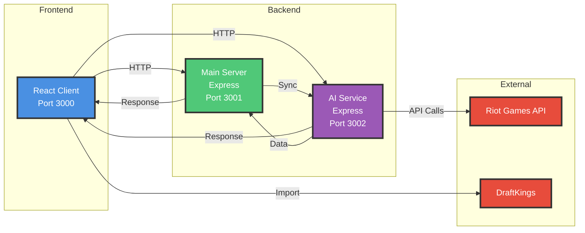

## Client Layer Architecture

**React Client - Port 3000**

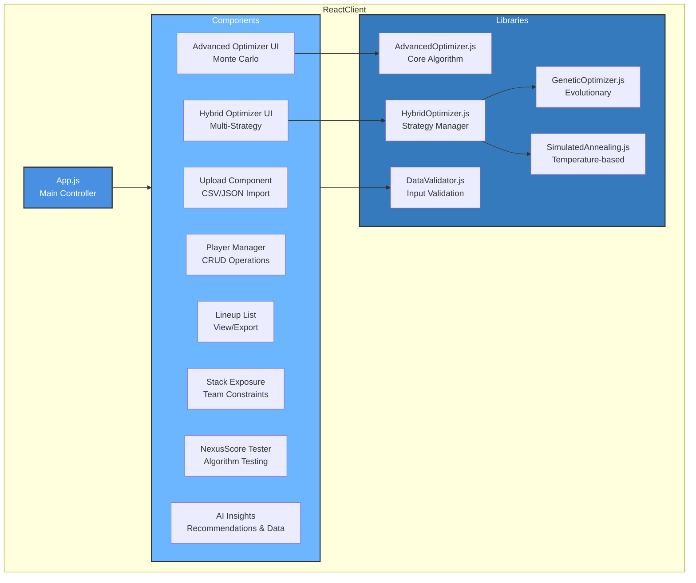

## Main Server Architecture

**Express Server - Port 3001**

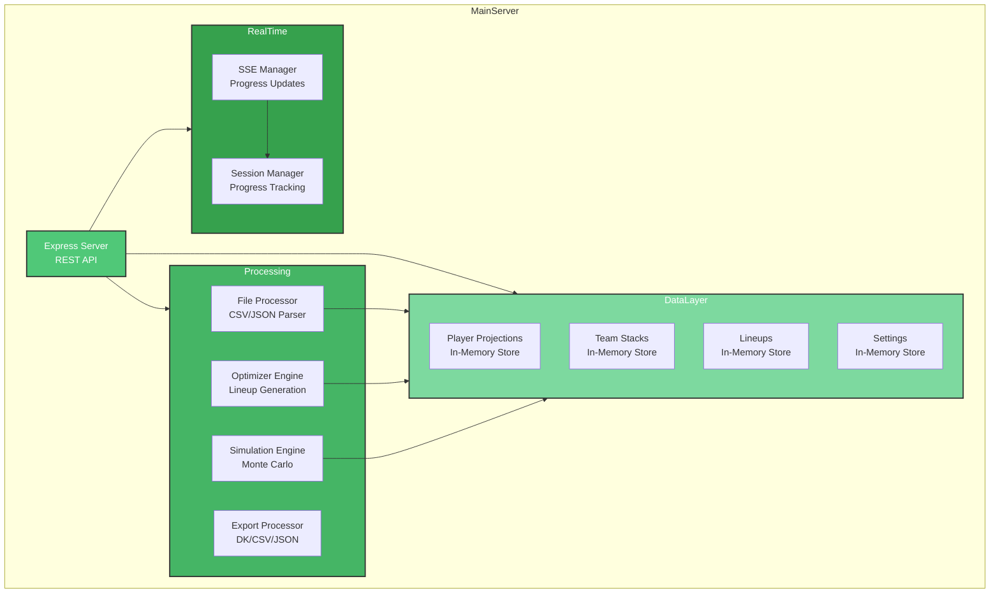

## AI Service Architecture

**AI Service - Port 3002**

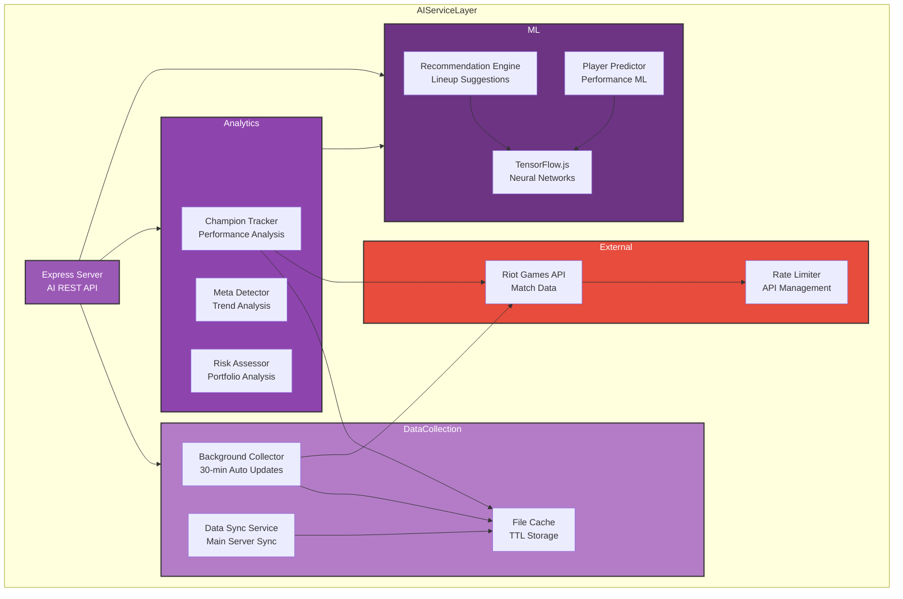

## Data Flow Sequences

### 1. Player Data Import Flow

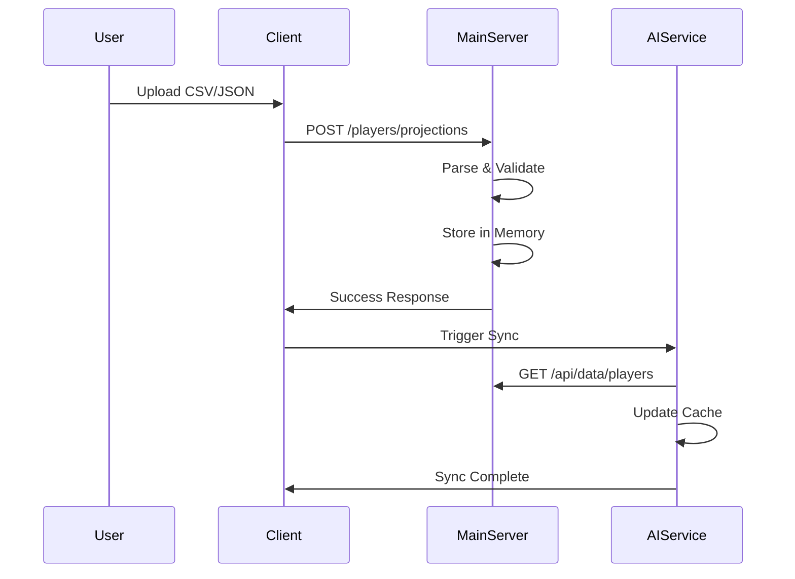

### 2. Lineup Generation Flow

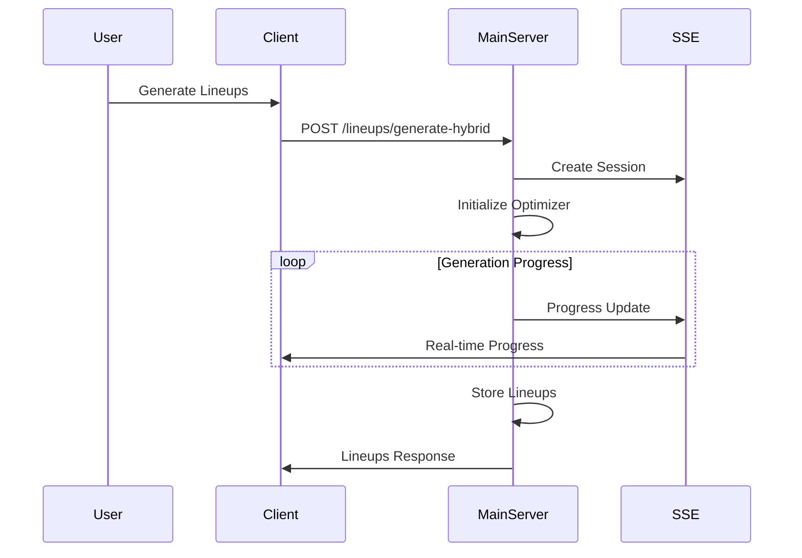

### 3. AI Enhancement Flow

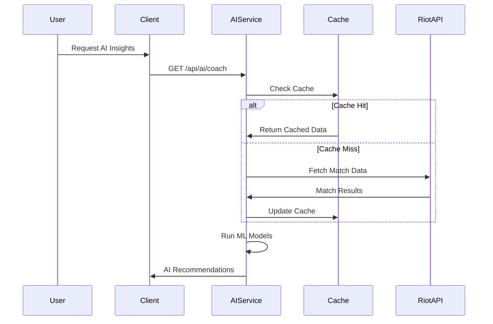

## Component Details

### Client Layer (Port 3000)

- **React UI**: Main user interface with tabbed navigation
- **AI Insights**: Real-time AI recommendations and data collection UI
- **Optimizer Components**: Hybrid and Advanced optimizer interfaces
- **Player Management**: CRUD operations for player data
- **Lineup Management**: View, export, and manage generated lineups
- **Stack Exposure**: Configure team stack exposure targets

### Main Server (Port 3001)

- **REST API**: Express server handling all core operations
- **In-Memory Data Store**: Stores player projections, lineups, and settings
- **Optimizer Engine**: Advanced Monte Carlo simulation engine
- **File Processor**: Handles CSV/JSON imports and exports
- **SSE Progress Updates**: Real-time optimization progress streaming

### AI Service (Port 3002)

- **AI REST API**: Dedicated API for AI features
- **Background Data Collector**: Automated 30-minute data collection
- **Champion Performance Tracker**: Dynamic player mapping and performance analysis
- **ML Models**: TensorFlow.js neural networks for predictions
- **Data Sync Service**: Synchronizes with main server data
- **Cache**: Stores collected data with TTL

### AI Components

- **Recommendation Engine**: Generates optimization suggestions
- **Meta Detector**: Analyzes current game meta trends
- **Player Predictor**: ML-based performance predictions
- **Risk Assessor**: Portfolio risk analysis
- **Data Collector**: Fetches and processes Riot API data

### External Services

- **Riot Games API**: Live match data and player statistics
- **DraftKings**: Contest data and player ID mappings

## Data Flow Patterns

### 1. Data Import Flow

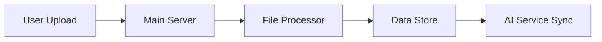

### 2. Optimization Flow

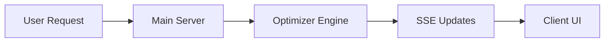

### 3. AI Enhancement Flow

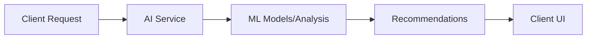

### 4. Background Collection Flow

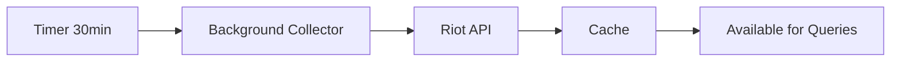

### 5. Live Data Flow

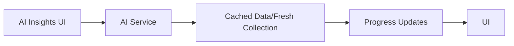

## Key Technologies

### Frontend

- React 18 with Hooks
- TailwindCSS
- Recharts for visualizations
- Server-Sent Events client

### Backend

- Node.js & Express
- Multer for file uploads
- CSV Parser
- Server-Sent Events

### AI Service

- TensorFlow.js
- Axios for HTTP requests
- Node-cron for scheduling
- File-based caching

### External APIs

- Riot Games API v4
- Rate limiting: 100 requests/2min, 20 requests/1s

## Communication Patterns

### REST API

- Main Server: Standard REST endpoints
- AI Service: Specialized AI endpoints
- Content-Type: application/json

### Server-Sent Events (SSE)

- Optimization progress updates
- Background collection status
- Real-time UI updates

### Data Synchronization

- AI Service polls Main Server for player/lineup data
- Cached for performance
- 5-minute sync intervals

## Deployment Considerations

### Development

- All services run locally
- `npm start` launches all services
- `npm run start-basic` for non-AI mode

### Production

- Services can be deployed independently
- AI Service optional (graceful degradation)
- Environment variables for configuration
- CORS enabled for cross-origin requests

### Scaling

- Main Server: Stateless, horizontally scalable
- AI Service: Single instance (background collector)
- Cache layer can be externalized (Redis)
- Rate limiting considerations for Riot API

## Security Considerations

- API keys stored in environment variables
- CORS configured for known origins
- Input validation on all endpoints
- Rate limiting on expensive operations
- No sensitive data in client state
